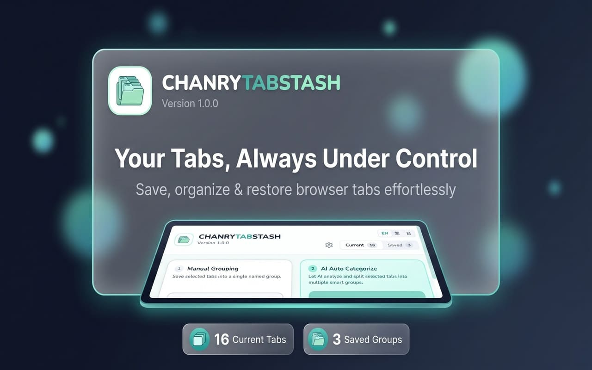
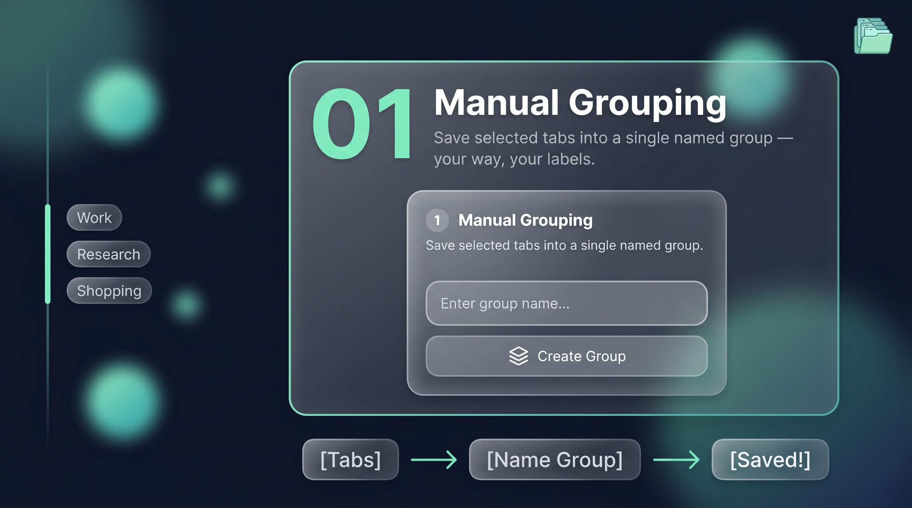
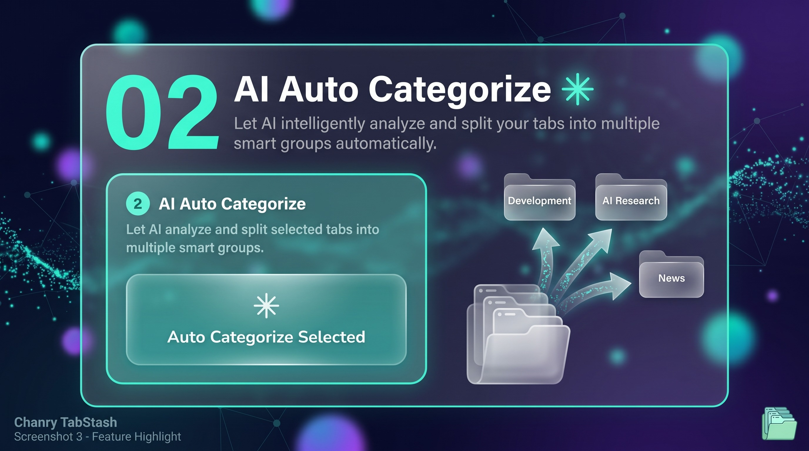
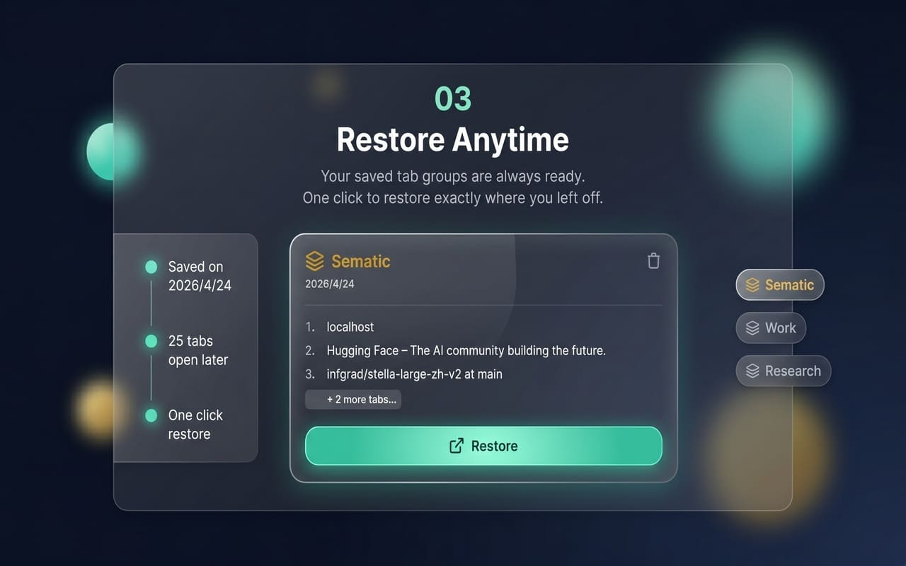
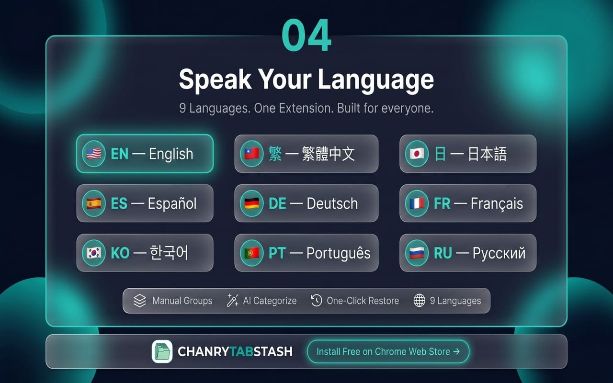

# ChanryTabStash







**ChanryTabStash** 是一個現代、清新可愛風格的 Chrome 分頁管理擴充功能。
針對常常開了幾十個分頁卻無從整理的你，提供「手動自訂群組」以及「**AI 智慧多重分類**」幫助您一鍵把凌亂的分頁歸檔收納！

---

## 核心特色 (Features)

* **AI 智慧多重分類：** 串接 Google Gemini AI，自動讀取您選取的分頁標題與網址，聰明理解意圖並拆分成多個適合的主題群組。
* **手動群組管理：** 如果您已經有明確的分類邏輯，也可以直接把勾選的分頁快速收納進自訂的單一群組中。
* **視覺原汁原味：** 完美保留您在 Chrome 所設定的各個群組標籤特有顏色，套用清新現代的馬卡龍風格。
* **自動更新通知：** 首頁自動檢測 GitHub 版本，若有新版本上線，會在畫面頂端出現親切的更新通知。
* **多國語系支援：** 內建繁體中文、英文、日文，可無縫切換陪伴您的開發或瀏覽日常。

---

## 如何安裝 (Installation)

目前專案尚未上架 Chrome Web Store，請透過「載入未封裝項目」的方式安裝使用：

1. **取得程式碼**：
   將此專案 Clone 到您的電腦中，或是直接下載 ZIP 解壓縮。
   ```bash
   git clone https://github.com/chanryTW/chanrytabstash.git
   ```

2. **安裝環境與打包** (開發者可透過這步打包最新版本)：
   > 若您是直接下載已打包好的 Release 版本（`dist` 資料夾），請略過此步驟。
   ```bash
   cd chanrytabstash
   yarn install
   yarn build
   ```
   執行完畢後，專案目錄中會產生一個 `dist` 資料夾。

3. **匯入 Chrome 瀏覽器**：
   * 打開您的 Chrome 瀏覽器，在網址列輸入 `chrome://extensions/`
   * 打開右上角的 **「開發人員模式 (Developer mode)」** 開關
   * 點擊左上角的 **「載入未封裝項目 (Load unpacked)」**
   * 選擇剛才專案資料夾底下打包出來的 `dist` 資料夾（或是如果您有完整的專案檔，選取包含 `manifest.json` 的主資料夾）
   
   **安裝完成！** 接下來您可以將擴充功能釘選在右上角，隨時點擊開啟！

---

## 如何使用 AI 智慧分類？

由於 AI 智慧分類依賴 Google Gemini 的服務，您需要自己申請一個專屬的 API 金鑰（免費），金鑰將**絕對安全地保存在您瀏覽器的本地端 (Local Storage)**，不會外流。

1. 到 [Google AI Studio](https://aistudio.google.com/app/apikey) 登入您的 Google 帳號。
2. 點擊 **Get API key** 並建立一把金鑰。
3. 打開 ChanryTabStash 擴充功能，點擊右上角的設定按鈕 (齒輪圖案)。
4. 將您的 API 金鑰貼上並點擊「確認」。
5. 現在起，勾選您想要整理的分頁，按一下 **「執行 AI 智慧分組」**，剩下的就交給強大的 AI 處理吧！

---

## 開發與技術棧 (Built With)

* **React 18**
* **Vite**
* **Tailwind CSS**
* **TypeScript**
* **Google Gemini SDK (`@google/genai`)**

---

### Copyright
© 2026 ChanryTabStash • Powered by Chanry. All Rights Reserved.
